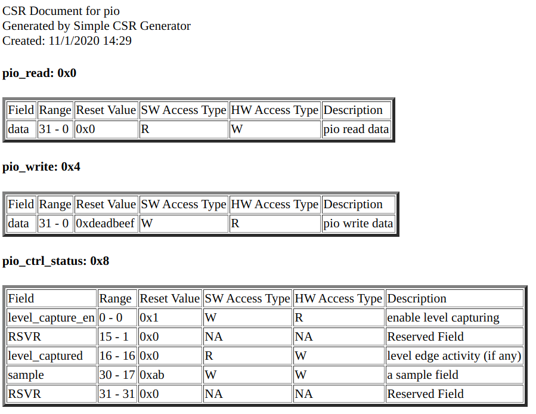

# Output File

- [Output File](#output-file)
  - [Verilog module](#verilog-module)
  - [HTML based documentation](#html-based-documentation)
  - [C header file](#c-header-file)

Simple CSR will generate the following output

1. Verilog module
2. HTML based documentation
3. C header file defining register address and field information

## Verilog module

The verilog module has 2 main interfaces: SW interface and HW interface.

- The SW interface is the address based or memory mapped interface. It performs read and write operation to the internal register.
- The HW interface provides the config value for the hardware logic and records the hardware status.

### SW interface

```verilog
input  [ADDR_WIDTH-1:0]     i_sw_address    // address, ADDR_WIDTH: Address width
input                       i_sw_read       // read access
input                       i_sw_write      // write access
input                       i_sw_select     // select this CSR module
input  [DATA_WIDTH-1:0]     i_sw_wrdata     // input write data
output [DATA_WIDTH-1:0]     o_sw_rddata     // output read data
```

Note:

- `sw_read` and `sw_write` can not be asserted at the same clock cycle

### HW interface

```verilog
input  [WIDTH-1:0]          i_hw_<register_name>_<field_name>   // Status Register
output [WIDTH-1:0]          o_hw_<register_name>_<field_name>   // Configuration Register
...
```

### Other signals

```verilog
input                       clk         // clock signal
input                       reset       // synchronous reset signal
```

## HTML based documentation

This is a human readable files specifying the following information

1. Registers name and address
2. Tables with all the field in the register follow the register
   1. Field location.
   2. SW and HW access type
   3. Reset Value
   4. Description of the field

### Example

Here is a screen shot of the generated html file in the pio example



## C header file

The C header file defines **register address** as well as information about each field within the registers. It also provides macro to extract each field from a register read data for read operation, macro to set a single field value, and macro to set the entire register value for write operation. This file is useful for SW development.

### Naming Convention

- The naming convention of the register variable is
  
  `<MODULE_NAME>__<REGISTER_NAME>`

- The naming convention of the field variable is
  
  `<MODULE_NAME>__<REGISTER_NAME>__<FIELD_NAME>__<SUFFIX/OPERATION>`

### Examples

```c
// =============================================
// Register: pio_ctrl_status, Address: 0x8
// =============================================
#define PIO__PIO_CTRL_STATUS
#define PIO__PIO_CTRL_STATUS_ADDR                           0x8

// Field: LEVEL_CAPTURE_EN, Offset: 0, Size: 1
#define PIO__PIO_CTRL_STATUS__LEVEL_CAPTURE_EN__OFT         0
#define PIO__PIO_CTRL_STATUS__LEVEL_CAPTURE_EN__MASK        0x1
#define PIO__PIO_CTRL_STATUS__LEVEL_CAPTURE_EN__get(data) \
        ((data >> PIO__PIO_CTRL_STATUS__LEVEL_CAPTURE_EN__OFT) & PIO__PIO_CTRL_STATUS__LEVEL_CAPTURE_EN__MASK)
#define PIO__PIO_CTRL_STATUS__LEVEL_CAPTURE_EN__set(LEVEL_CAPTURE_EN) \
        ((LEVEL_CAPTURE_EN << PIO__PIO_CTRL_STATUS__LEVEL_CAPTURE_EN__OFT) & PIO__PIO_CTRL_STATUS__LEVEL_CAPTURE_EN__MASK)

// Field: LEVEL_CAPTURED, Offset: 16, Size: 1
#define PIO__PIO_CTRL_STATUS__LEVEL_CAPTURED__OFT           16
#define PIO__PIO_CTRL_STATUS__LEVEL_CAPTURED__MASK          0x10000
#define PIO__PIO_CTRL_STATUS__LEVEL_CAPTURED__get(data) \
        ((data >> PIO__PIO_CTRL_STATUS__LEVEL_CAPTURED__OFT) & PIO__PIO_CTRL_STATUS__LEVEL_CAPTURED__MASK)
#define PIO__PIO_CTRL_STATUS__LEVEL_CAPTURED__set(LEVEL_CAPTURED) \
        ((LEVEL_CAPTURED << PIO__PIO_CTRL_STATUS__LEVEL_CAPTURED__OFT) & PIO__PIO_CTRL_STATUS__LEVEL_CAPTURED__MASK)

// Field: SAMPLE, Offset: 17, Size: 14
#define PIO__PIO_CTRL_STATUS__SAMPLE__OFT                   17
#define PIO__PIO_CTRL_STATUS__SAMPLE__MASK                  0x7ffe0000
#define PIO__PIO_CTRL_STATUS__SAMPLE__get(data) \
        ((data >> PIO__PIO_CTRL_STATUS__SAMPLE__OFT) & PIO__PIO_CTRL_STATUS__SAMPLE__MASK)
#define PIO__PIO_CTRL_STATUS__SAMPLE__set(SAMPLE) \
        ((SAMPLE << PIO__PIO_CTRL_STATUS__SAMPLE__OFT) & PIO__PIO_CTRL_STATUS__SAMPLE__MASK)

#define PIO__PIO_CTRL_STATUS__set(SAMPLE, LEVEL_CAPTURED, LEVEL_CAPTURE_EN) (\
        PIO__PIO_CTRL_STATUS__SAMPLE__set(SAMPLE) | \
        PIO__PIO_CTRL_STATUS__LEVEL_CAPTURED__set(LEVEL_CAPTURED) | \
        PIO__PIO_CTRL_STATUS__LEVEL_CAPTURE_EN__set(LEVEL_CAPTURE_EN))